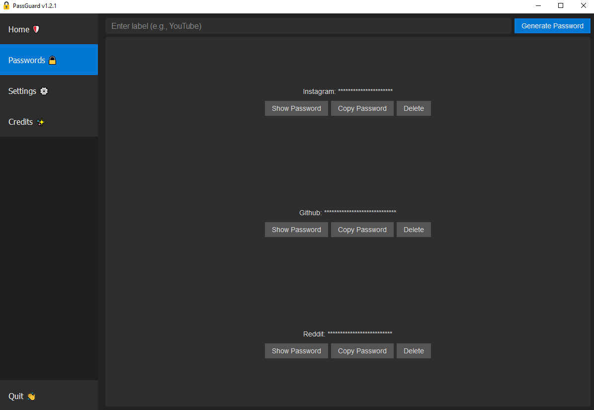

# PassGuard 🛡️
Password manager built in Python



## Quickstart 🛠️
If you want to contribute to the development of PassGuard, follow these steps:
1. **Install Python 3.11**: Make sure Python 3.11 is installed on your system. You can download it from [python.org](https://www.python.org/downloads/). 🐍

2. **Clone the Repository**: Clone the repository using the following command:
   ```bash
   git clone https://github.com/zaheyanez/passguard.git

3. **Create a Virtual Environment**: Navigate to the project directory and create a virtual environment:
    ```bash
    cd passguard
    ```
    ```bash
    python -m venv env

4. **Activate the virtual enviroment**:
    - On Windows:
        ```bash
        .\env\Scripts\activate

    - On macOS/Linux:
        ```bash
        source env/bin/activate

5. **Install Dependencies**: Install the project dependencies using pip:
    ```bash
    pip install -r requirements.txt

6. **Run the project...**
    ```bash
    python passguard.py
